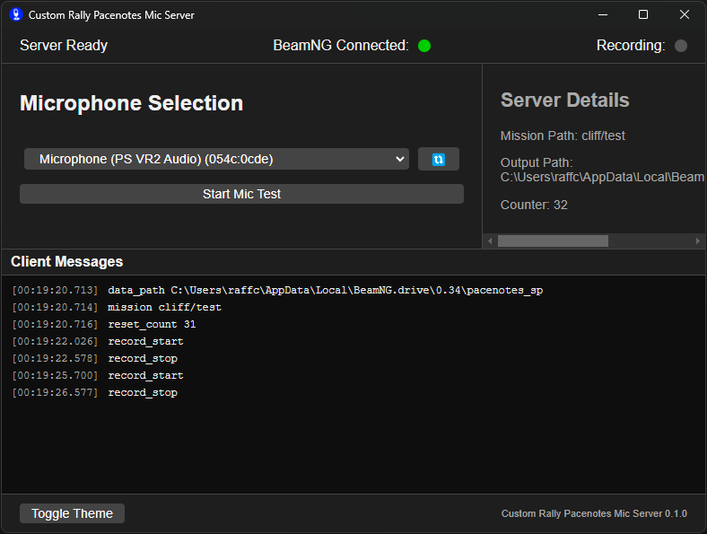

# Custom Rally Pacenotes Mic App
This program is a standalone executable for recording pacenotes in combination with the [Custom Rally Pacenotes mod for BeamNG.drive](https://www.beamng.com/resources/custom-rally-pacenotes.32263/).

This program is built using Electron, and internally uses FFmpeg to convert the recorded audio to an `ogg` (so that BeamNG can play it back).

## Installation

To use this program, please download the latest release from the **[GitHub Releases page](https://github.com/chrisraff/custom-pacenotes-mic-app/releases)**. Once downloaded, run the installer and follow the instructions.

**Note:** Always download the installer form this GitHub releases page to ensure authenticity and avoid any potential issues.

## Development and Building

### Setup
`npm install`

### Run for development
`npm start`

### Build installer for distribution
`npx electron-builder --win`
